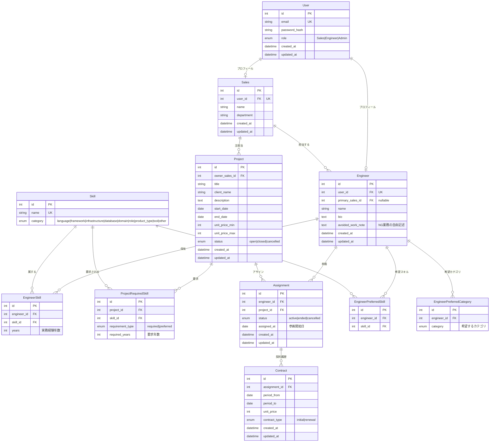

# Bridge — ER図

## 概要
Day2で確定したデータモデル v2。
主要10テーブル構成。Mermaid記法でGitHub上で直接レンダリングされる。

---

## ER図



---

## 設計判断の根拠

### User と Sales/Engineer の3テーブル分離
- **判断**:認証情報(User)とロール固有プロフィール(Sales/Engineer)を分離
- **理由**:
  - 認証ロジックは User だけを見れば済む
  - `Engineer.primary_sales_id` が `Sales.id` を参照することで、型として「営業ロールのユーザーしか担当営業になれない」ことが保証される
  - 将来「1ユーザーが複数ロールを持つ」拡張にも耐える
- **トレードオフ**:ユーザー作成時に2テーブルへの書き込みが必要(トランザクション必須)
- **「触る人とロールは別概念」**という思想に基づく

### Engineer.primary_sales_id は nullable
- **理由**:新規登録直後のエンジニアは担当営業が未割当の可能性があるため
- 実務では「先に技術者情報を登録 → 後から営業が担当を決める」フローが一般的

### EngineerSkill.years は整数(開始日ではなく年数)
- **判断**:`years` を整数で直接保持
- **理由**:
  - 「そのスキルを知ってからの期間」と「業務で使った期間」がズレる問題を回避
  - 業務での実経験年数として定義が明確
  - 入力UIがシンプル

### Skill.category は9分類
- **判断**:`language|framework|infrastructure|database|domain|role|product_type|tool|other`
- **理由**:SES業界で扱うスキルは Web系開発の分類では表現しきれない
  - 業務ドメイン(金融・製造・医療…)
  - 工程/役割(PM・PMO・コンサル・BA…)
  - 開発種別(Web・業務系・組込・パッケージ導入・運用保守…)
- UI上のグループ化表示に必要
- **原体験との接続**:「開発志望だったがパッケージ導入案件に入れられた」痛みは `product_type` カテゴリで表現される

### ProjectRequiredSkill は required/preferred を分ける
- **判断**:`requirement_type` enum で required/preferred を区別、`required_years` も保持
- **理由**:営業は「必須だけ満たす」と「必須・歓迎とも満たす」で営業の仕方が異なる
- 複数スキルの AND/OR 組み合わせは将来拡張(DB・クエリ複雑化を避ける)

### Contract に status カラムを持たせない
- **判断**:現在有効かは `period_from`/`period_to` と今日の日付で計算
- **理由**:
  - 日付と status の二重管理はデータ不整合の温床
  - アサインの生死は業務判断(status 必要)だが、契約の生死は日付で機械的に判定可能
- **トレードオフ**:「将来の更新契約が合意済み」のようなケースは明示的に扱えない → MVPでは不要と判断(YAGNI)
- **API レスポンス側で `isCurrent` フラグを返すことで補完**(`/engineers/{id}/assignments` の契約レベル)

### Assignment と Contract は別エンティティ(1対多)
- **判断**:1つの Assignment に対して Contract が時系列で積み上がる
- **理由**:
  - SES は3ヶ月に1回程度の契約更新があり、1:1では履歴が追えない
  - 単価推移・更新タイミング・契約履歴がそのままキャリア履歴になる
  - エンジニアの原体験「契約更新時期を後から知った」を構造的に解決する
- **α案採用**:技術者×案件の組み合わせごとに Assignment を1レコード。技術者が複数案件を転々とすれば Assignment も増える

### Assignment.assigned_at を残す(Contract.period_from と重複しない)
- **判断**:assigned_at は削除せず存置
- **理由**:
  - **参画(Assignment)と契約(Contract)は別概念**
  - 参画開始日 ≠ 契約開始日 のケースは現場で普通に発生する(契約書遅延、前倒し参画、初日挨拶のみ等)
  - 意味が違うカラムは、値が同じになりがちでも分離するのが正しい設計
- **DDDのアグリゲート境界**として扱う

### Assignment.status を明示カラムで持つ(計算しない)
- **判断**:`status` enum(`active|ended|cancelled`)で明示管理
- **理由**:
  - Contract の日付から計算する方式は、クエリが重くなる
  - フラグ管理は実態とズレるリスクがある
  - 明示的な状態管理は、「一時中断」「トラブル退場」等の状態拡張にも耐える

### Project.unit_price はレンジ(min/max)
- **判断**:`unit_price_min` と `unit_price_max` で保持
- **理由**:SES案件の単価はレンジで提示されるのが一般的。単一値ではリアリティが失われる

### CareerPreference を独立テーブルにせず分解
- **希望スキル**:`EngineerPreferredSkill`(多対多)
- **希望カテゴリ**:`EngineerPreferredCategory`(多対多、マッチングのポジティブスコア向け)
- **避けたい業務**:`Engineer.avoided_work_note`(自由記述)
- **理由**:
  - 「避けたい業務」を構造化すると列挙が無限に発散する
  - 自由記述+構造化の中間案で、実装コストと表現力のバランスを取る
  - NGの構造化は将来拡張

### Skill マスタの初期データ
- **判断**:シードデータ(SQLマイグレーションに含める)で投入
- **理由**:CSVインポート画面は実装コストが重い(画面・バリデーション・文字コード対応)
- 将来拡張としてCSVインポート機能を README に記載

---

## 主要なマッチングロジック(設計メモ)

案件×技術者のマッチングはソフトスコアリング方式(ハードフィルタではない)。

```
score = (必須スキル一致数 × 3)
      + (歓迎スキル一致数 × 1)
      + (必須スキルの年数充足ボーナス × 0.5)
      - (必須スキルの年数不足ペナルティ × 1)
      + (希望カテゴリ一致ボーナス × 2)
```

- MVP では「稼働中の技術者」は対象外(空きのある技術者のみスコアリング)
- 「1ヶ月後に空く技術者」を対象化するのは将来拡張
- 具体的な係数は実装時に調整(完璧な式を目指さず、「なぜこの重みにしたか」を説明できる範囲で固定する)
