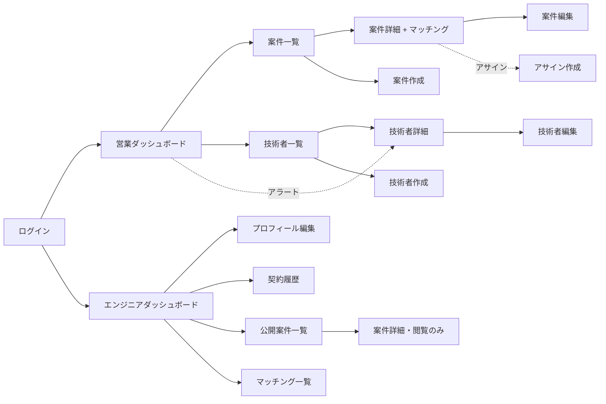

# Bridge — 画面設計

## 1. デザイン方針

### 1.1 UI ライブラリ
- **Material-UI (MUI)** を採用
- 業務アプリとしての情報密度と一覧性を重視
- `DataGrid`、`Card`、`Chip`、`Alert` を中心的に利用

### 1.2 デザイントーン
- **情報密度**:高め。テーブル・カードでの一覧表示を多用
- **カラーパレット**:プライマリ=ネイビー/ディープブルー系、アクセント=オレンジ(アラート用)
- **タイポグラフィ**:MUIデフォルト(Roboto) + `Noto Sans JP`
- **余白**:MUIデフォルトより少し詰め気味(`Spacing={1}`〜`2`)
- **アイコン**:`@mui/icons-material` を活用

### 1.3 選定理由(面接回答の骨子)
Bridge は業務ユースケースのアプリであり、情報密度と一覧性を重視してMUIの `DataGrid` を中心に据えた。カラーは信頼感のあるネイビーをプライマリに、アラートはオレンジで明確に視認できるよう分離した。

---

## 2. 画面一覧(全15画面)

### 2.1 認証
| # | 画面名 | URL | 権限 |
|---|---|---|---|
| 1 | ログイン | `/login` | Anonymous |

### 2.2 営業ビュー
| # | 画面名 | URL | 権限 |
|---|---|---|---|
| 2 | 営業ダッシュボード | `/` | Sales |
| 3 | 案件一覧 | `/projects` | Sales |
| 4 | 案件詳細(マッチング表示) | `/projects/:id` | Sales |
| 5 | 案件作成/編集 | `/projects/new`, `/projects/:id/edit` | Sales |
| 6 | 技術者一覧 | `/engineers` | Sales |
| 7 | 技術者詳細 | `/engineers/:id` | Sales |
| 8 | 技術者作成/編集 | `/engineers/new`, `/engineers/:id/edit` | Sales |

### 2.3 エンジニアビュー
| # | 画面名 | URL | 権限 |
|---|---|---|---|
| 9 | エンジニアダッシュボード | `/` | Engineer |
| 10 | 自分のプロフィール編集 | `/me/profile` | Engineer |
| 11 | 自分の契約履歴 | `/me/contracts` | Engineer |
| 12 | 公開案件一覧(マッチ度順) | `/projects` | Engineer |
| 13 | 案件詳細(エンジニア視点・閲覧のみ) | `/projects/:id` | Engineer |
| 14 | 自分へのマッチング一覧 | `/me/matches` | Engineer |

### 2.4 共通
| # | 画面名 | URL | 権限 |
|---|---|---|---|
| 15 | 404 / エラー | `*` | - |

### 2.5 補足
- 画面 4/13 は同一 URL (`/projects/:id`) でロールにより表示を分岐
- 画面 3/12 は同一 URL (`/projects`) でロールにより表示を分岐
- 画面 5/8 は作成/編集を1画面で対応
- 実装対象は実質 12 画面程度
- Week3 で遅延が発生した場合、画面 14 をダッシュボード(画面 9)に吸収して削除

---

## 3. 主要画面ワイヤーフレーム

### 3.1 画面9:エンジニアダッシュボード(作品の主題)

```
┌─────────────────────────────────────────────────────────────┐
│ Bridge                         田中 太郎 さん  ▼ [ログアウト]│
├─────────────────────────────────────────────────────────────┤
│ [ホーム] [プロフィール] [契約履歴] [公開案件]                  │
├─────────────────────────────────────────────────────────────┤
│                                                             │
│  契約ステータス                                              │
│  ┌───────────────────────────────────────────────────────┐  │
│  │ ⚠ 要注意:契約終了まで残り 23 日・更新未定             │  │
│  │                                                       │  │
│  │ 現在の案件:  金融系Webアプリ開発(A銀行)             │  │
│  │ 契約期間:    2025-03-01 ~ 2025-05-31                  │  │
│  │ 単価:        85万円 / 月                              │  │
│  │ 担当営業:    佐藤 営業  [連絡する]                    │  │
│  └───────────────────────────────────────────────────────┘  │
│                                                             │
│  キャリア志向                                                │
│  ┌───────────────────────────────────────────────────────┐  │
│  │ 希望スキル:   React, TypeScript, AWS                  │  │
│  │ 希望カテゴリ: Web開発, フロントエンド                 │  │
│  │ 避けたい業務: パッケージ導入, 運用保守                │  │
│  │                                       [編集する >]    │  │
│  └───────────────────────────────────────────────────────┘  │
│                                                             │
│  あなたにマッチする案件(トップ3)                          │
│  ┌───────────────────────────────────────────────────────┐  │
│  │ #1  92点  SaaS フロントエンド開発(B社)               │  │
│  │          React/TS, 80-100万, 2025-06-01〜             │  │
│  ├───────────────────────────────────────────────────────┤  │
│  │ #2  87点  新規Webサービス立ち上げ(C社)               │  │
│  │          TypeScript/Next.js, 75-95万, 2025-05-15〜    │  │
│  ├───────────────────────────────────────────────────────┤  │
│  │ #3  81点  モダン基幹システム(D社)                   │  │
│  │          C#/React, 70-90万, 2025-07-01〜              │  │
│  │                              [すべてのマッチを見る >] │  │
│  └───────────────────────────────────────────────────────┘  │
│                                                             │
└─────────────────────────────────────────────────────────────┘
```

**設計意図**:
- 契約ステータスカードをファーストビューに配置。情報非対称性解消の主題そのもの
- ステータスは3段階で色分け:`更新済(緑)` / `契約中 残り◯日(中立)` / `要注意 残り30日以内・更新未定(橙/赤)`
- 「更新未定」表示は、本人から営業に連絡する契機となる
- 担当営業からの連絡導線をカード内に配置
- マッチング結果のプレビュー(トップ3)で主要機能への導線を確保

**契約ステータスの判定ロジック**(ER図設計より):
```
現在の契約 = 最新の Contract(period_to が今日以降)
次の契約 = 現在の契約の period_to 以降に始まる Contract

if (次の契約 が存在)
  → "更新済: YYYY-MM-DD まで延長"
else if (現在の契約の残日数 ≤ 30)
  → "要注意: 契約終了まで残り◯日・更新未定"
else
  → "契約中: 残り◯日"
```

---

### 3.2 画面2:営業ダッシュボード

```
┌─────────────────────────────────────────────────────────────┐
│ Bridge                         佐藤 営業 さん  ▼ [ログアウト]│
├─────────────────────────────────────────────────────────────┤
│ [ホーム] [案件] [技術者]                                      │
├─────────────────────────────────────────────────────────────┤
│                                                             │
│  ⚠ 契約更新アラート(担当エンジニア)                        │
│  ┌───────────────────────────────────────────────────────┐  │
│  │ 田中 太郎   A銀行案件    残り23日  更新未定  [詳細 >] │  │
│  │ 鈴木 花子   C社案件      残り15日  更新未定  [詳細 >] │  │
│  │ 山田 次郎   D社案件      残り28日  調整済    [詳細 >] │  │
│  └───────────────────────────────────────────────────────┘  │
│                                                             │
│  あなたの担当案件                                            │
│  ┌───────────────────────────────────────────────────────┐  │
│  │ タイトル          クライアント  ステータス  アサイン  │  │
│  ├───────────────────────────────────────────────────────┤  │
│  │ 金融系Web開発     A銀行         募集中      1 / 3名   │  │
│  │ SaaSフロント開発  B社           募集中      0 / 2名   │  │
│  │ 基幹システム      D社           クローズ    2 / 2名   │  │
│  │                                    [すべての案件 >]   │  │
│  └───────────────────────────────────────────────────────┘  │
│                                                             │
│  あなたの担当エンジニア(稼働状況)                          │
│  ┌───────────────────────────────────────────────────────┐  │
│  │ 田中 太郎   稼働中  A銀行案件   〜2025-05-31           │  │
│  │ 鈴木 花子   稼働中  C社案件     〜2025-04-27           │  │
│  │ 山田 次郎   空き    -           2025-05-01〜           │  │
│  │                                 [すべてのエンジニア >] │  │
│  └───────────────────────────────────────────────────────┘  │
│                                                             │
└─────────────────────────────────────────────────────────────┘
```

**設計意図**:
- 契約更新アラートをファーストビューに配置(エンジニア側主題の対称)
- 「担当案件/担当エンジニア」に絞って表示(Day2で決めた「自分ごとダッシュボード」)
- 空きエンジニア一覧で、営業の最頻業務(マッチング候補探し)への導線を確保

---

### 3.3 画面4:案件詳細(マッチング表示)

**作品の技術的ハイライト**。面接で最も深掘りされる画面。

```
┌─────────────────────────────────────────────────────────────┐
│ ← 案件一覧に戻る                                             │
├─────────────────────────────────────────────────────────────┤
│ 金融系Webアプリ開発                          [編集] [閉じる] │
│ A銀行 ・ 募集中 ・ 担当:佐藤 営業                           │
├─────────────────────────────────────────────────────────────┤
│                                                             │
│  案件情報                                                    │
│  ┌───────────────────────────────────────────────────────┐  │
│  │ 期間:    2025-06-01 〜 2025-12-31                     │  │
│  │ 単価:    70万〜90万 / 月                              │  │
│  │ 概要:    メガバンク向けの投信管理システムの...        │  │
│  │                                                       │  │
│  │ 必須スキル:                                           │  │
│  │   • React (3年以上)                                   │  │
│  │   • TypeScript (2年以上)                              │  │
│  │   • C# (5年以上)                                      │  │
│  │   • 金融ドメイン経験 (2年以上)                        │  │
│  │ 歓迎スキル:                                           │  │
│  │   • AWS (1年以上)                                     │  │
│  └───────────────────────────────────────────────────────┘  │
│                                                             │
│  マッチング候補(スコア順)                                  │
│  ┌───────────────────────────────────────────────────────┐  │
│  │ ┌─ #1  田中 太郎 ────────────────── スコア: 85 ─┐   │  │
│  │ │ スコア内訳:                                      │   │  │
│  │ │   スキル一致:55 / 年数充足:20 / 希望合致:10     │   │  │
│  │ │                                                  │   │  │
│  │ │ ✓ React         必須 3年以上  実績 5年         │   │  │
│  │ │ ✓ TypeScript    必須 2年以上  実績 4年         │   │  │
│  │ │ △ C#            必須 5年以上  実績 3年 不足    │   │  │
│  │ │ ✗ 金融ドメイン  必須 2年以上  実績 なし        │   │  │
│  │ │ ✓ AWS           歓迎 1年以上  実績 2年         │   │  │
│  │ │                                                  │   │  │
│  │ │ 希望カテゴリ一致: ● Web開発                     │   │  │
│  │ │ 担当営業:佐藤 営業    [この案件にアサイン >]   │   │  │
│  │ └──────────────────────────────────────────────────┘   │  │
│  │ ┌─ #2  鈴木 花子 ────────────────── スコア: 72 ─┐   │  │
│  │ │ ... (同様の構造) ...                             │   │  │
│  │ └──────────────────────────────────────────────────┘   │  │
│  └───────────────────────────────────────────────────────┘  │
│                                                             │
└─────────────────────────────────────────────────────────────┘
```

**設計意図**:
- マッチング理由を全部可視化:スコアだけでなく「なぜこの人か」が見える
- `skillEvaluations.status` を視覚アイコンで表現(matched=✓ / insufficient=△ / unmet=✗)
- `scoreBreakdown` を明示的に表示
- マッチング結果からアサイン作成への導線

**想定Q&A**:
- Q: このマッチング画面の一番こだわった点は?
- A: 必須スキルを満たさない技術者でも、どの要素が足りないかを明示すること。現実のSES営業では「React経験は足りないが、他の強みで通せるかも」という判断が日常的に発生するので、スコアでフィルタするのではなく、営業が判断できる材料を並べる設計にした。

---

### 3.4 画面11:契約履歴(エンジニア視点)

原体験が最も直接的に表現される画面。

```
┌─────────────────────────────────────────────────────────────┐
│ ← ホームに戻る                                               │
├─────────────────────────────────────────────────────────────┤
│ 契約履歴                                                     │
│                                                             │
│  現在の契約                                                  │
│  ┌───────────────────────────────────────────────────────┐  │
│  │ 金融系Webアプリ開発(A銀行)                           │  │
│  │ 2025-03-01 〜 2025-05-31  単価:85万                   │  │
│  │ ⚠ 残り23日 ・ 更新未定                                │  │
│  │ 担当営業:佐藤 営業  [連絡する]                        │  │
│  └───────────────────────────────────────────────────────┘  │
│                                                             │
│  過去の契約                                                  │
│  ┌───────────────────────────────────────────────────────┐  │
│  │ 金融系Webアプリ開発(A銀行)                           │  │
│  │ 2024-12-01 〜 2025-02-28  単価:85万  [初回]          │  │
│  │                                                       │  │
│  │ パッケージ導入支援(Z社)                             │  │
│  │ 2024-06-01 〜 2024-11-30  単価:75万  [更新]          │  │
│  │                                                       │  │
│  │ パッケージ導入支援(Z社)                             │  │
│  │ 2024-03-01 〜 2024-05-31  単価:70万  [初回]          │  │
│  └───────────────────────────────────────────────────────┘  │
│                                                             │
└─────────────────────────────────────────────────────────────┘
```

**設計意図**:
- Day2で決めた「Assignment-Contract の1対多」がここで効く
- 単価推移が暗黙的に見える(70万 → 75万 → 85万 の成長)
- 初回/更新の区別を `Contract.contract_type` で表示
- 将来拡張:単価推移グラフ、スキル習得年表など

---

## 4. 画面遷移図



---

## 5. 実装時の注意点
- ロール分岐する画面(3/12、4/13)は、ルーティング側で単一コンポーネントに振り分け、内部でロール判定する
- 認証必須画面は MUI の Layout コンポーネントで共通化
- `DataGrid` の利用時はサーバーサイドページングを前提に組む(N+1対策)
- マッチング画面はレンダリング負荷が高いため、初期表示は20件、ページングで追加読み込み

## 6. モバイル対応方針

モバイルは「外出先でさっと確認する」用途に絞り、フル機能は提供しない。

### 6.1 基本ルール

- ブレークポイントは MUI の `md`(900px)未満をモバイルとして扱う(`shared/hooks/useIsMobile`)
- 一覧画面は横長テーブル(DataGrid)の代わりに**カード型リスト**で表示する
  - 技術者: `EngineerCardList`(氏名・稼働状況・現在案件・担当営業・スキル・**メール連絡先リンク**)
  - 案件: `ProjectCardList`(タイトル・クライアント・ステータス・単価・開始日・マッチ度)
  - 更新間近契約: `ExpiringContractCardList`(技術者・案件・残日数・更新状況)
- ページングはカード一覧の下に MUI `Pagination` を置く

### 6.2 モバイルで提供しない機能

- Excel インポート(`/import`)— ナビタブから非表示(URL 直接アクセスは可能だが案内しない)

### 6.3 ヘッダー

- モバイルではユーザー名を省略し、パスワード変更/ログアウトはアイコンボタンにする
- ナビタブは横スクロール(`variant="scrollable"`)
